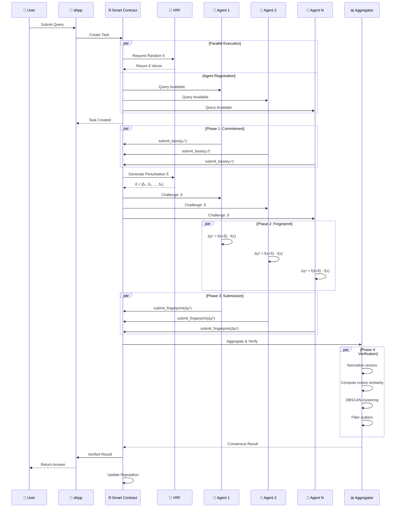
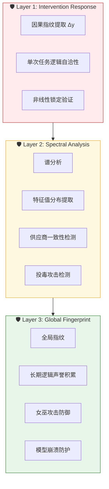
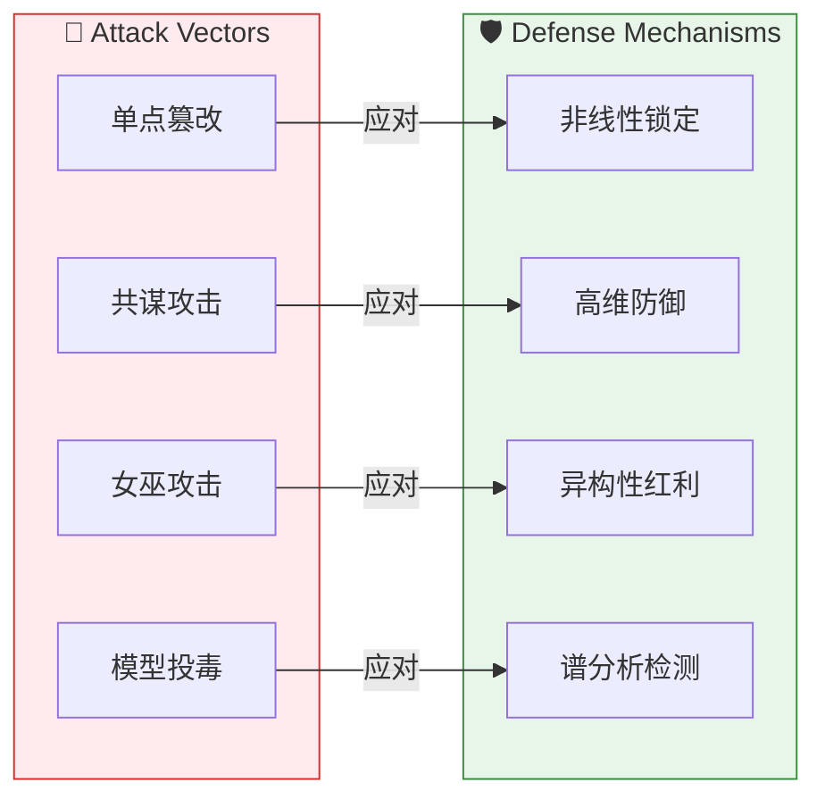
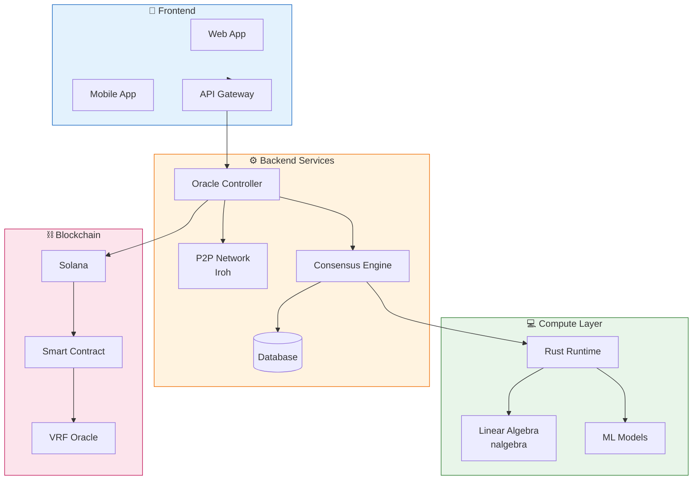

# Multi-Agent Oracle Overall Pipeline

## 系统整体架构流程图

```mermaid
flowchart TB
    subgraph Client["🌐 Client Layer"]
        User[        DApp[📱 d👤 User Request]
App]
    end

    subgraph Chain["⛓️ Blockchain Layer (Solana)"]
        VRF[🎲 VRF Random Generator]
        Contract[📜 Smart Contract]
        State["💾 State Management"]
    end

    subgraph Oracle["🔮 Oracle Network Layer"]
        Registry[📋 Agent Registry]
        Pool["🤖 Agent Pool<br/>GPT-4 / Claude / Llama / Custom"]
    end

    subgraph Verification["🔐 Causal Fingerprint Verification"]
        subgraph Phase1["Phase 1: Task Commitment"]
            Commit[📝 Submit Base Prediction y₀]
        end
        
        subgraph Phase2["Phase 2: Causal Perturbation"]
            Perturb[🎯 Generate Random δ Vector]
            Challenge[📢 Publish Challenge]
        end
        
        subgraph Phase3["Phase 3: Fingerprint Extraction"]
            Response[🧠 Calculate Δy = f(x+δ) - f(x)]
            SubmitFP[📤 Submit Fingerprint]
        end
        
        subgraph Phase4["Phase 4: Aggregation & Verification"]
            Normalize[📐 Vector Normalization]
            Similarity[🔗 Cosine Similarity Matrix]
            Cluster[📊 DBSCAN Clustering]
            Consensus[✅ Consensus Reached]
            Filter[❌ Outlier Filtering]
        end
    end

    subgraph Output["📤 Output Layer"]
        Result[🎯 Final Verified Result]
        Reputation[⭐ Update Reputation]
        Fingerprint[🆔 Global Fingerprint]
    end

    User --> DApp
    DApp --> Contract
    
    Contract --> VRF
    VRF --> Perturb
    
    Pool --> Registry
    Registry --> Commit
    Commit --> Challenge
    Challenge --> Response
    Response --> SubmitFP
    SubmitFP --> Normalize
    Normalize --> Similarity
    Similarity --> Cluster
    Cluster --> Filter
    Filter --> Consensus
    
    Consensus --> Result
    Consensus --> Reputation
    Reputation --> Fingerprint
    
    Result --> DApp
    DApp --> User

    style Client fill:#e8f5e9,stroke:#2e7d32
    style Chain fill:#e3f2fd,stroke:#1565c0
    style Oracle fill:#fff3e0,stroke:#ef6c00
    style Verification fill:#fce4ec,stroke:#c2185b
    style Output fill:#f3e5f5,stroke:#7b1fa2
```

## 详细工作流程



## 三层验证体系



## 安全博弈模型



## 技术架构


